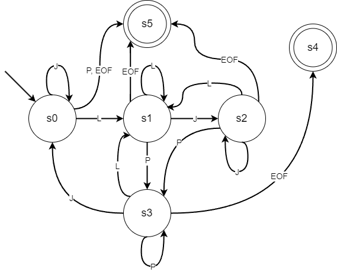

# Генератор фраз и диалогов

Программа для синтаксического анализа текста и генерации продолжения текста на основе N-грамм.

## Описание

### Конечный автомат для разбора предложений



Формальное определение автомата M = (Q, Σ, δ, q₀, F), где:

- Q = {S₀, S₁, S₂, S₃, S₄, S₅} - множество состояний
- Σ = {L, P, W, EOF} - входной алфавит, где:
  * L - буквы и апостроф (isLetter c || c == '\'')
  * P - знаки пунктуации (. ! ? ; : ( ))
  * W - пробельные и прочие символы
  * EOF - конец входной строки
- q₀ = S₀ - начальное состояние
- F = {S₄, S₅} - множество конечных состояний
- δ: Q × Σ → Q - функция переходов:

| Состояние | L | P | W | EOF |
|-----------|---|---|---|-----|
| S₀        | S₁| Sₑ| S₀| S₅ |
| S₁        | S₁| S₃| S₂| S₅ |
| S₂        | S₁| S₃| S₂| S₅ |
| S₃        | S₁| S₃| S₀| S₄ |
| S₄        | S₄| S₄| S₄| S₄ |
| S₅        | S₅| S₅| S₅| S₅ |

Где:
- S₀: Начальное состояние
- S₁: Чтение слова
- S₂: Пропуск пробелов/мусора
- S₃: Чтение знаков пунктуации
- S₄: Конечное состояние (успех)
- Sₑ: Состояние ошибки

### Общее описание программы
Программа выполняет следующие задачи:

1. Синтаксический анализ текста:
   - Чтение текста из файла
   - Разбиение на предложения (по знакам .!?;:)
   - Обработка слов с учетом апострофов (например, "don't" как одно слово)
   - Удаление пунктуации и цифр

2. Создание модели N-грамм:
   - Построение биграмм (пары слов)
   - Построение триграмм (тройки слов)
   - Формирование словаря, где ключами являются:
     * одиночные слова
     * пары слов
   - Значениями в словаре являются списки возможных продолжений

3. Генерация фраз:
   - Пользователь вводит начальное слово
   - Программа генерирует фразу случайной длины (от 2 до 15 слов)
   - Если слово отсутствует в словаре, выводится сообщение об ошибке

4. Диалог моделей:
   - Использование двух разных текстов для создания двух моделей
   - Генерация диалога заданной глубины M
   - Ответы основываются на последнем слове из фразы оппонента
   - При отсутствии слова в словаре используется предпоследнее слово и т.д.

## Использование

1. Подготовьте два текстовых файла:
   - `input.txt` - текст для первой модели
   - `input2.txt` - текст для второй модели

2. Запустите программу:
   ```bash
   stack build
   stack exec phrases-generator-exe
   ```

3. Следуйте инструкциям:
   - Введите начальное слово для диалога
   - Укажите желаемое количество обменов репликами

## Технические детали

- Язык программирования: Haskell
- Используемые библиотеки:
  * text - для работы с текстом
  * random - для генерации случайных чисел
- Парсинг реализован с использованием комбинаторов парсеров

## Структура проекта

- `src/Lib.hs` - основная логика программы
- `app/Main.hs` - точка входа и взаимодействие с пользователем

## Лицензия

Данный проект распространяется под лицензией BSD 3-Clause. Подробности в файле [LICENSE](LICENSE).

## Дополнительно

Проект создан с использованием:
- GHC (Glasgow Haskell Compiler)
- Stack (инструмент для разработки Haskell проектов)
- Cabal (система сборки)

Для сообщений об ошибках и предложений используйте раздел Issues на GitHub.
