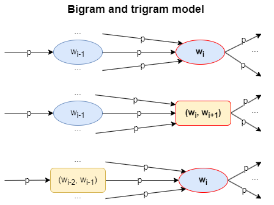

# EN - Phrase and Dialogue Generator

A program for parsing text and generating text continuation based on N-grams.

## Description

### Finite State Automaton for Sentence Parsing


M = (Q, Σ, δ, q₀, F), where:

- Q = {S₀, S₁, S₂, S₃, S₄, S₅} - set of states
- Σ = {L, P, W, EOF} - input alphabet, where:
  * L - letters and apostrophes (isLetter c || c == '\'')
  * P - punctuation marks (. ! ? ; : ( ))
  * W - whitespace and other characters
  * EOF - end of input
- q₀ = S₀ - initial state
- F = {S₄, S₅} - set of final states
- δ: Q × Σ → Q - transition functions:

|   State   | L | P | W | EOF |
|-----------|---|---|---|-----|
| S₀        | S₁| Sₑ| S₀| S₅ |
| S₁        | S₁| S₃| S₂| S₅ |
| S₂        | S₁| S₃| S₂| S₅ |
| S₃        | S₁| S₃| S₀| S₄ |
| S₄        | S₄| S₄| S₄| S₄ |
| S₅        | S₅| S₅| S₅| S₅ |

Where:
- S₀: Initial state
- S₁: Reading a word
- S₂: Skipping whitespace/garbage
- S₃: Reading punctuation marks
- S₄: Final state (success)
- Sₑ: Error state

### Mathematical Model for Text Generation

#### N-grams and Markov Chains



Text generation is based on a combined bigram and trigram model using Markov chains:

1. **Bigram Model** (top part of the diagram):
   - States: individual words \( wᵢ \)
   - Transitions: \( P(wᵢ|wᵢ₋₁) \) - the probability \( p \) of transitioning from word \( wᵢ₋₁ \) to word \( wᵢ \)
   - Each subsequent word depends only on the previous one.

2. **Combined Bigram-Trigram Model** (middle part of the diagram):
   - States:
     * Individual words \( wᵢ₋₁ \)
     * Pairs of words \( (wᵢ, wᵢ₊₁) \)
   - Transitions:
     * From a single word to a pair of words with probability \( p \)
   - Captures longer dependencies.

3. **Trigram Model** (bottom part of the diagram):
   - States:
     * Pairs of words \( (wᵢ₋₂, wᵢ₋₁) \)
     * Individual words \( wᵢ \)
   - Transitions: \( P(wᵢ|wᵢ₋₂, wᵢ₋₁) \) - the probability \( p \) of transitioning from a pair of words to the next word.
   - Each subsequent word depends on the two previous ones.

In this implementation, the transition probability \( p \) for a specific word among the possible continuations is uniform random — each continuation is selected with equal probability using a random number generator.

### Overview of the Program

The program performs the following tasks:

1. **Text Parsing**:
   - Reads text from a file.
   - Splits text into sentences (based on .!?;:).
   - Processes words, preserving apostrophes (e.g., "don't" as a single word).
   - Removes punctuation and digits.

2. **N-gram Model Creation**:
   - Builds bigrams (pairs of words).
   - Builds trigrams (triplets of words).
   - Creates a dictionary where keys are:
     * Single words.
     * Word pairs.
   - Values in the dictionary are lists of possible continuations.

3. **Phrase Generation**:
   - The user inputs a starting word.
   - The program generates a phrase of random length (from 2 to 15 words).
   - If the word is not found in the dictionary, an error message is displayed.

4. **Model Dialogue**:
   - Uses two different texts to create two models.
   - Generates a dialogue of specified depth \( M \).
   - Responses are based on the last word of the opponent’s phrase.
   - If the word is missing in the dictionary, the program falls back to the penultimate word, and so on.

## Usage

1. Prepare two text files:
   - `input.txt` - text for the first model.
   - `input2.txt` - text for the second model.

2. Run the program:
   ```bash
   stack build
   stack exec phrases-generator-exe
   ```

3. Follow the instructions:
   - Input the starting word for the dialogue.
   - Specify the desired number of exchanges.

## Technical Details

- Language: Haskell
- Libraries:
  * text - for text processing.
  * random - for random number generation.
- Parsing is implemented using parser combinators.

## Project Structure

- `src/Lib.hs` - core logic of the program.
- `app/Main.hs` - entry point and user interaction.

## License

[](https://opensource.org/licenses/BSD-3-Clause)

This project is licensed under the BSD 3-Clause License. Details can be found in the [LICENSE](LICENSE) file.

## Additional Information

Project uses:
- GHC (Glasgow Haskell Compiler)
- Stack (tool for Haskell project development)
- Cabal (building system)
Для сообщений об ошибках и предложений используйте раздел Issues на GitHub.

# RU - Генератор фраз и диалогов

Программа для синтаксического анализа текста и генерации продолжения текста на основе N-грамм.

## Описание

### Конечный автомат для разбора предложений


Формальное определение автомата M = (Q, Σ, δ, q₀, F), где:

- Q = {S₀, S₁, S₂, S₃, S₄, S₅} - множество состояний
- Σ = {L, P, W, EOF} - входной алфавит, где:
  * L - буквы и апостроф (isLetter c || c == '\'')
  * P - знаки пунктуации (. ! ? ; : ( ))
  * W - пробельные и прочие символы
  * EOF - конец входной строки
- q₀ = S₀ - начальное состояние
- F = {S₄, S₅} - множество конечных состояний
- δ: Q × Σ → Q - функция переходов:

| Состояние | L | P | W | EOF |
|-----------|---|---|---|-----|
| S₀        | S₁| Sₑ| S₀| S₅ |
| S₁        | S₁| S₃| S₂| S₅ |
| S₂        | S₁| S₃| S₂| S₅ |
| S₃        | S₁| S₃| S₀| S₄ |
| S₄        | S₄| S₄| S₄| S₄ |
| S₅        | S₅| S₅| S₅| S₅ |

Где:
- S₀: Начальное состояние
- S₁: Чтение слова
- S₂: Пропуск пробелов/мусора
- S₃: Чтение знаков пунктуации
- S₄: Конечное состояние (успех)
- Sₑ: Состояние ошибки

### Математическая модель генерации текста

#### N-граммы и цепи Маркова


Генерация текста основана на комбинированной модели биграмм и триграмм с использованием марковских цепей:

1. Биграммная модель (верхняя часть диаграммы):
- Состояния: отдельные слова wᵢ
- Переходы: P(wᵢ|wᵢ₋₁) - вероятность p перехода от слова wᵢ₋₁ к слову wᵢ
- Каждое следующее слово зависит только от предыдущего

2. Комбинированная биграммно-триграммная модель (средняя часть диаграммы):
- Состояния: 
  * Одиночные слова wᵢ₋₁
  * Пары слов (wᵢ, wᵢ₊₁)
- Переходы: 
  * От одиночного слова к паре слов с вероятностью p
  * Позволяет учитывать более длинные зависимости

3. Триграммная модель (нижняя часть диаграммы):
- Состояния: 
  * Пары слов (wᵢ₋₂, wᵢ₋₁)
  * Одиночные слова wᵢ
- Переходы: P(wᵢ|wᵢ₋₂,wᵢ₋₁) - вероятность p перехода от пары слов к следующему слову
- Каждое следующее слово зависит от двух предыдущих

В данной реализации вероятность p перехода к конкретному слову из множества возможных следующих слов является равномерно случайной - каждое слово из возможных продолжений выбирается с одинаковой вероятностью с помощью генератора случайных чисел.

### Общее описание программы
Программа выполняет следующие задачи:

1. Синтаксический анализ текста:
   - Чтение текста из файла
   - Разбиение на предложения (по знакам .!?;:)
   - Обработка слов с учетом апострофов (например, "don't" как одно слово)
   - Удаление пунктуации и цифр

2. Создание модели N-грамм:
   - Построение биграмм (пары слов)
   - Построение триграмм (тройки слов)
   - Формирование словаря, где ключами являются:
     * одиночные слова
     * пары слов
   - Значениями в словаре являются списки возможных продолжений

3. Генерация фраз:
   - Пользователь вводит начальное слово
   - Программа генерирует фразу случайной длины (от 2 до 15 слов)
   - Если слово отсутствует в словаре, выводится сообщение об ошибке

4. Диалог моделей:
   - Использование двух разных текстов для создания двух моделей
   - Генерация диалога заданной глубины M
   - Ответы основываются на последнем слове из фразы оппонента
   - При отсутствии слова в словаре используется предпоследнее слово и т.д.

## Использование

1. Подготовьте два текстовых файла:
   - `input.txt` - текст для первой модели
   - `input2.txt` - текст для второй модели

2. Запустите программу:
   ```bash
   stack build
   stack exec phrases-generator-exe
   ```

3. Следуйте инструкциям:
   - Введите начальное слово для диалога
   - Укажите желаемое количество обменов репликами

## Технические детали

- Язык программирования: Haskell
- Используемые библиотеки:
  * text - для работы с текстом
  * random - для генерации случайных чисел
- Парсинг реализован с использованием комбинаторов парсеров

## Структура проекта

- `src/Lib.hs` - основная логика программы
- `app/Main.hs` - точка входа и взаимодействие с пользователем

## Лицензия

[](https://opensource.org/licenses/BSD-3-Clause)

Данный проект распространяется под лицензией BSD 3-Clause. Подробности в файле [LICENSE](LICENSE).

## Дополнительно

Проект создан с использованием:
- GHC (Glasgow Haskell Compiler)
- Stack (инструмент для разработки Haskell проектов)
- Cabal (система сборки)

Для сообщений об ошибках и предложений используйте раздел Issues на GitHub.
